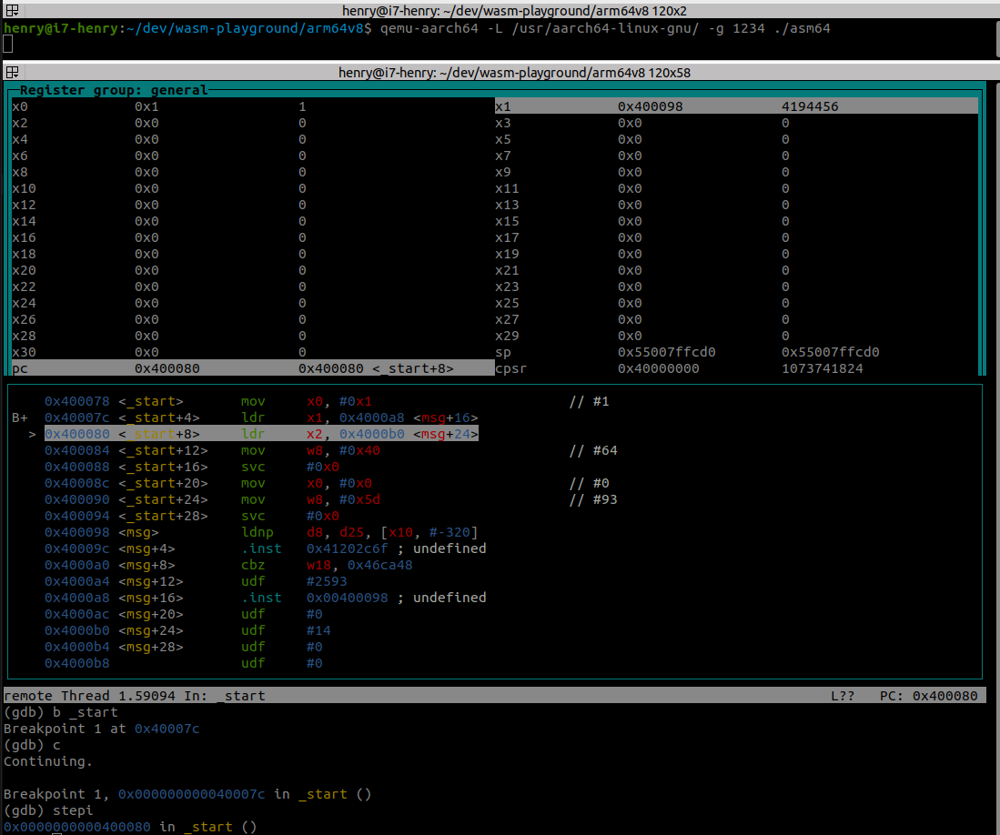
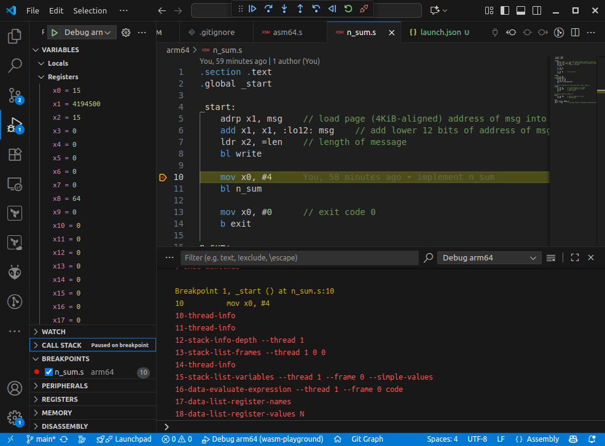

# Build Instructions

## Prerequisites

## C Source Code

```C
#include <stdio.h>

int main() {
    printf("Hello, ARM!\n");
    return 0;
}
```

## ARM (32-bit, EABI5, hard float)

### Prerequisites

`sudo apt install gcc-arm-linux-gnueabihf binutils-arm-linux-gnueabihf binutils-arm-linux-gnueabihf-dbg`

### Build and Run

```bash
$ arm-linux-gnueabihf-gcc -static -o hello hello.c
$ file hello
hello: ELF 32-bit LSB executable, ARM, EABI5 version 1 (GNU/Linux), statically linked, BuildID[sha1]=75855565b3fd299b3e6450fadc60e5865234e310, for GNU/Linux 3.2.0, not stripped
$ ./hello
Hello, ARM!
```

## ARM aarch64 (64-bit)

### Prerequisites

`sudo apt install qemu-user qemu-user-static gcc-aarch64-linux-gnu binutils-aarch64-linux-gnu binutils-aarch64-linux-gnu-dbg build-essential`

### Build and Run

#### Statically linked

```bash
$ aarch64-linux-gnu-gcc -static -o hello hello.c
$ file hello
hello: ELF 64-bit LSB executable, ARM aarch64, version 1 (GNU/Linux), statically linked, BuildID[sha1]=ac301e968570cdc346c10e9f441d69db83450876, for GNU/Linux 3.7.0, not stripped
$ ./hello
Hello, ARM!
```

#### Dynamically linked

```bash
$ aarch64-linux-gnu-gcc -o hello hello.c
$ file hello
hello: ELF 64-bit LSB pie executable, ARM aarch64, version 1 (SYSV), dynamically linked, interpreter /lib/ld-linux-aarch64.so.1, BuildID[sha1]=116d101ab32de822a56ef6e3b19f9fa897910fff, for GNU/Linux 3.7.0, not stripped
$ qemu-aarch64 -L /usr/aarch64-linux-gnu ./hello
Hello, ARM!
```

## Assembly Source Code

```armasm
.section .text
.global _start

_start:
/* syscall write(int fd, const void *buf, size_t count) */
    mov x0, #1     
    ldr x1, =msg 
    ldr x2, =len 
    mov w8, #64     // syscall number for 'write'
    svc #0

/* syscall exit(int status) */
    mov x0, #0 
    mov w8, #93     // syscall number for 'exit'
    svc #0

msg:
.ascii "Hello, ARM64!\n"
len = . - msg
```

### ARM aarch64 (64-bit), Statically linked

```bash
$ aarch64-linux-gnu-as asm64.s -o asm64.o && aarch64-linux-gnu-ld asm64.o -o asm64
$ file asm64
asm64: ELF 64-bit LSB executable, ARM aarch64, version 1 (SYSV), statically linked, not stripped
$ ./asm64 
Hello, ARM64!
```

### Disassemble

```bash
$ aarch64-linux-gnu-objdump -d asm64

asm64:     file format elf64-littleaarch64


Disassembly of section .text:

0000000000400078 <_start>:
  400078:	d2800020 	mov	x0, #0x1                   	// #1
  40007c:	58000161 	ldr	x1, 4000a8 <msg+0x10>
  400080:	58000182 	ldr	x2, 4000b0 <msg+0x18>
  400084:	52800808 	mov	w8, #0x40                  	// #64
  400088:	d4000001 	svc	#0x0
  40008c:	d2800000 	mov	x0, #0x0                   	// #0
  400090:	52800ba8 	mov	w8, #0x5d                  	// #93
  400094:	d4000001 	svc	#0x0

0000000000400098 <msg>:
  400098:	6c6c6548 	.word	0x6c6c6548
  40009c:	41202c6f 	.word	0x41202c6f
  4000a0:	34364d52 	.word	0x34364d52
  4000a4:	0a21      	.short	0x0a21
  4000a6:	00980000 	.inst	0x00980000 ; undefined
  4000aa:	0040      	.short	0x0040
  4000ac:	00000000 	.word	0x00000000
  4000b0:	0000000e 	.word	0x0000000e
  4000b4:	00000000 	.word	0x00000000

```

## Use Debugger

`sudo apt install gdb-multiarch qemu-user`

build with debug symbols (`-ggdb3`):

`$ aarch64-linux-gnu-as asm64.s -ggdb3 -o asm64.o && aarch64-linux-gnu-ld asm64.o -o asm64`

Start the executable in the emulator using `-g <port>` to wait for a debugger to connect:

`qemu-aarch64 -L /usr/aarch64-linux-gnu/ -g 1234 ./asm64`

Run the debugger and connect to the emulator:

`gdb-multiarch -q --nh -ex 'set architecture aarch64' -ex 'file asm64' -ex 'target remote localhost:1234' -ex 'layout split' -ex 'layout regs'`

Set breakpoint at the beginning (`b _start`) and start the program (`c`):



### With Visual Studio Code

1. Install the [Native Debug](https://marketplace.visualstudio.com/items?itemName=webfreak.debug) extension.

2. Adapt `.vscode/launch.json` to match your environment and executable. 

3. Compile with debug-symbols (`-ggdb3`) and run the executable in a terminal: 

```bash
$ aarch64-linux-gnu-as n_sum.s -ggdb3 -o n_sum.o && aarch64-linux-gnu-ld n_sum.o -o n_sum && qemu-aarch64 -L /usr/aarch64-linux-gnu/ -g 1234 ./n_sum
```

4. Set a breakpoint in the source-file and start the debugger



## Use External Assembly Function in C Source

Compile both source files together including debug symbols:

`aarch64-linux-gnu-gcc -ggdb3 -static -o n_sum n_sum.c n_sum_extern.s`

Start the executable in the emulator using `-g <port>` to wait for a debugger to connect:

`qemu-aarch64 -L /usr/aarch64-linux-gnu/ -g 1234 ./n_sum`

Start the debugger and connect to the emulator:

`gdb-multiarch -q --nh -ex 'set architecture aarch64' -ex 'file n_sum' -ex 'target remote localhost:1234' -ex 'layout split' -ex 'layout regs'`

1. Set first breakpoint in `main()` with `b main`. Start execution with `c`. 
2. Set next breakpoint at the beginning of the external function with `b n_sum_extern`. Continue execution with `c`.

Debugging with Visual Studio Code works exactly the same as described above.